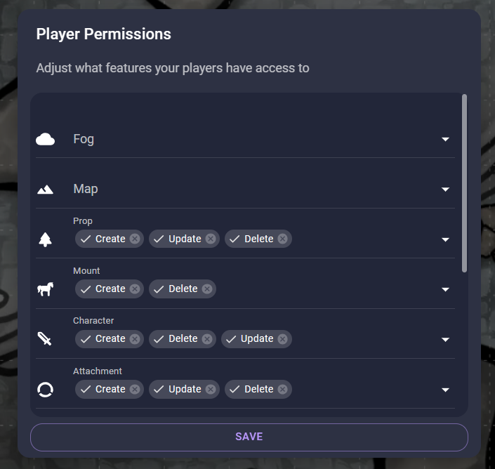

# Bubble Tracker

Add Roll20 style bubbles to track hit points, temporary hit points, and armor class.

## How to use

### Basic

This extension does math for you! To add 6 to you HP type +6. This works for every bubble.

This extension is deigned to be keyboard friendly.

1. Click on a token and use the shortcut Shift + S to see and edit a token's trackers.
2. Press Tab to cycle through the bubbles.
3. Press the space key to toggle the switch.
4. When you're done press Escape and the menu will close.

This extension works with tokens on the Prop, Mount, and Character layers.

### For GMs

Keep your secrets by removing the player update permission on the mount layer. Now, put your monsters on the mount layer and your players won't be able to see their stats. Using the mount layer allows compatibility with the official Owlbear Rodeo initiative tracker.

### Support

If you need support for this extension you can open an issue on [GitHub](https://github.com/SeamusFinlayson/Bubbles-for-Owkbear-Rodeo)
