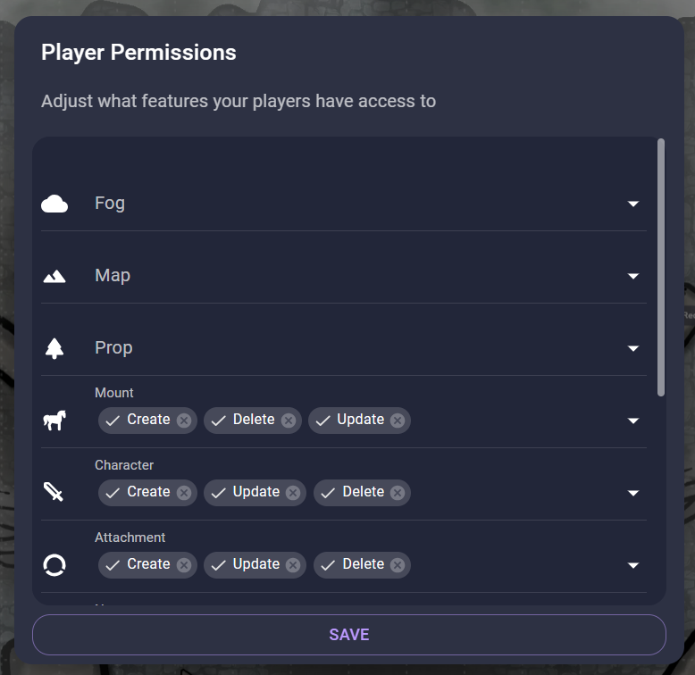

# Bubble Tracker

This extension tracks hit points, temporary hit points, and armor class with Roll20 style bubbles.

## How to use

### Basic

This extension is deigned to be keyboard friendly.

1. Click on a token and use the shortcut Shift + S to see and edit a token's trackers.
2. Press Tab to cycle through the bubbles.
3. When you're done press Escape or Enter and the menu will close.

This extension works with tokens on the Prop, Mount, and Character layers.

### For GMs

Keep your secrets by removing the player permissions on the prop layer. Now, put your monsters on the prop layer and your players won't be able to see their stats. 

### Support

If you need support for this extension you can open an issue on [GitHub](https://github.com/SeamusFinlayson/Bubbles-for-Owkbear-Rodeo)
